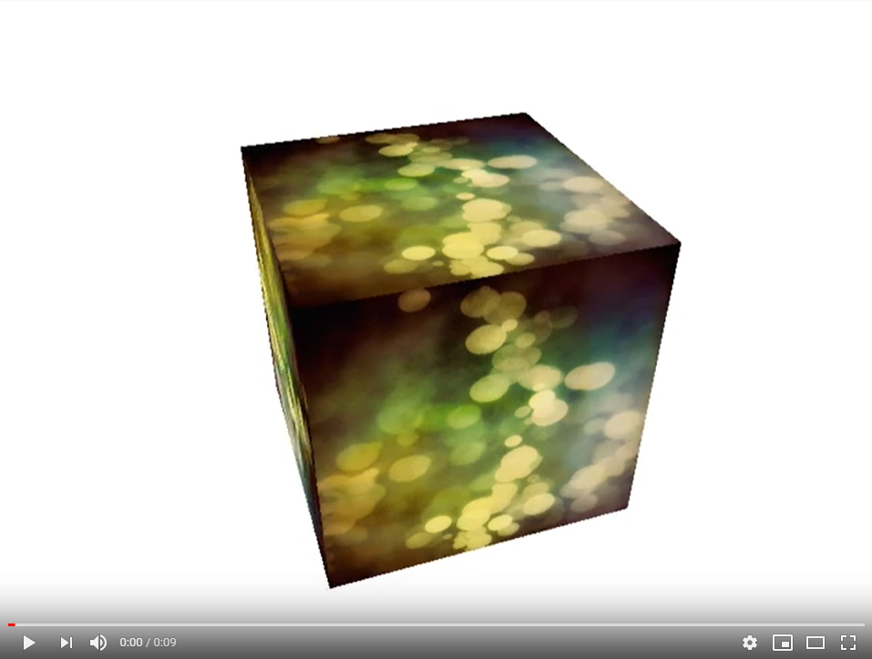

# Cube 3D( via openGL for GoLang )
This script rendering via [openGL](https://www.opengl.org/) / [OpenGL for GoLang](https://github.com/go-gl) rotaiting 3D Cube

## Quick Start
```sh
    git clone https://github.com/GHRik/Cube3D.git
    cd Cube3D
    go run cube.go
```
 
## Requirements
To properly run script you have to gave instaled and **ready to use**:

* Gcc compiler ( for example [MiniGW 64](http://mingw-w64.org/doku.php/download) )
* [Golang for windows](https://golang.org/doc/install)
After install GoLang you have to **go get** a module:
```sh
go get github.com/go-gl/gl/v4.1-core/gl
go get github.com/go-gl/glfw/v3.3/glfw
go get github.com/go-gl/mathgl/mgl32
```
 
## Dir structure


## Demo vid
[](https://youtu.be/mngblAU54EA)

## Reference links

* [OpenGL](https://www.opengl.org/)
* [GoLang openGL](https://github.com/go-gl)
* [GoLang GLFW](https://github.com/go-gl/glfw)
* [GoLang Math](https://github.com/go-gl/mathgl)
* [GoLang Glow](https://github.com/go-gl/glow)
* [GoLang Windows](https://golang.org/doc/install)
* [MiniGW 64bit Windows](http://mingw-w64.org/doku.php/download)
* [Gcc, the GNU Compiler](https://gcc.gnu.org/)
* [GoLang doc](https://golang.org/doc/)
